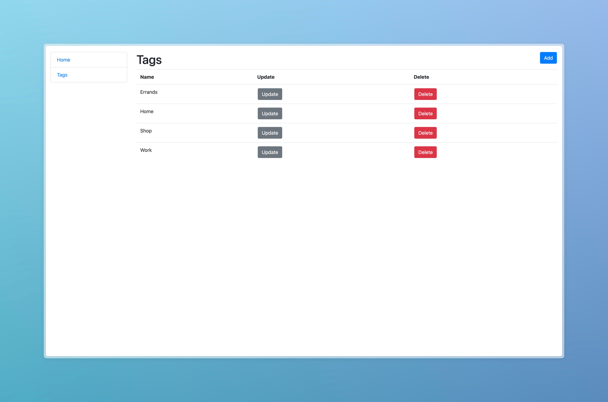

## Installation
#### Python 3 must be already installed
1. Clone the repository:
   ```bash
   git clone https://github.com/tetianasobko/to-do-list.git
   cd to_do_list
2. Create and activate a virtual environment:
   ```bash
   python -m venv venv
   source venv/bin/activate  # For Linux/Mac
   venv\Scripts\activate  # For Windows
3. Install dependencies:
    ```bash
   pip install -r requirements.txt

4. Apply database migrations:
    ```bash
   python manage.py migrate
5. Start the development server:
    ```bash
   python manage.py runserver

## Demo


